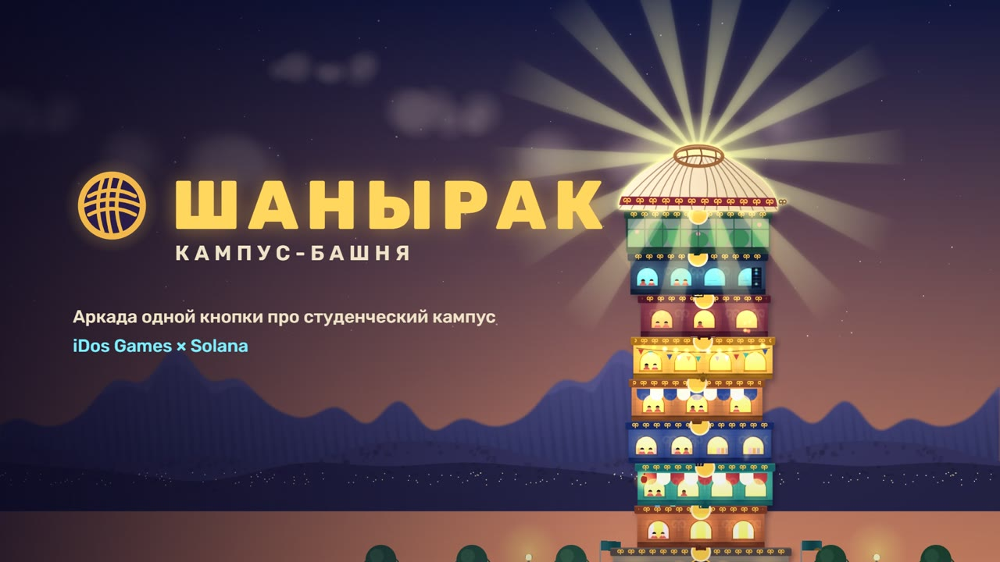
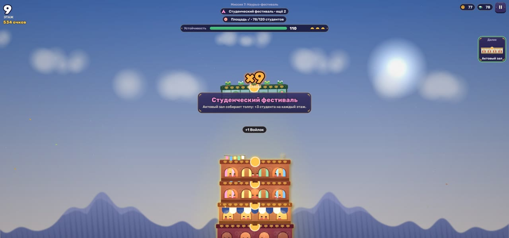
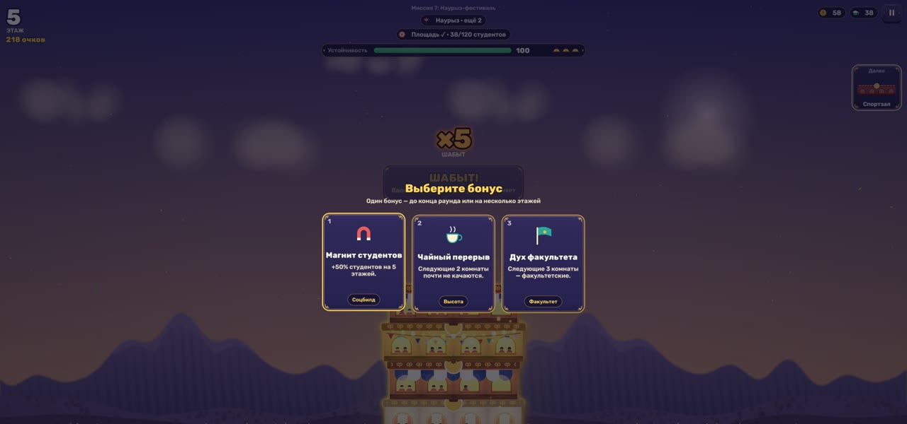
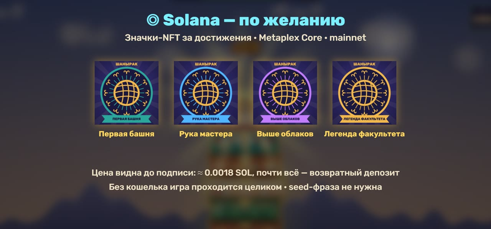
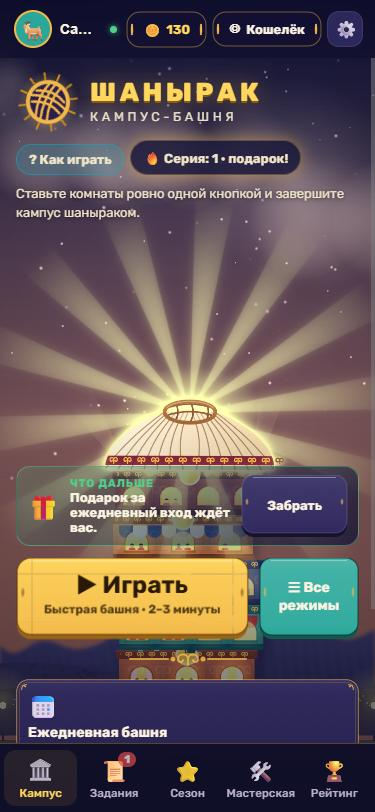
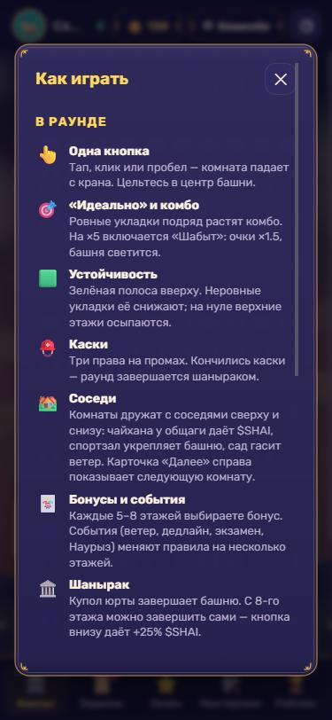
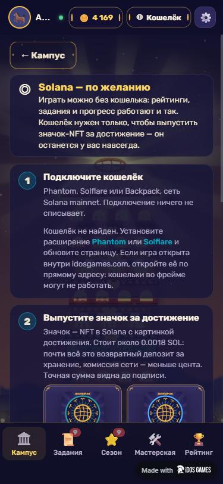

# ШАНЫРАК — Campus Tower

[](https://github.com/kuatov2002/shanyrak-colosseum/actions/workflows/ci.yml)
[](https://solana.com)
[](https://developers.metaplex.com/core)
[](https://pixijs.com)
[](https://idosgames.com/app/JE8W0Z54/)
[](https://colosseum.org)

> A **one-button stacking arcade** about building a Kazakh student campus: drop the dorm, the chaikhana, the library and
> the IT lab onto a swaying tower, chain perfect drops into combos, survive wind and exam-week deadlines — and crown every
> round with a **shanyrak**, the yurt's crown and the symbol of home. Solana is **the easiest way in, never a wall**: one
> free wallet signature signs the player in (no transaction, no password), and an achievement can become a **Metaplex Core**
> badge in that wallet, with the exact cost shown before they sign.

[**Play now**](https://je8w0z54.idos.games/) · [Trailer (40 s)](docs/media/trailer.mp4) · [Judges' guide](docs/JUDGES.md) · [Architecture](docs/ARCHITECTURE.md) · [Об игре (RU)](docs/GAME.md) · [Platform page](https://idosgames.com/app/JE8W0Z54/)

---



---

## Submission to the iDos Games × Solana hackathon (Colosseum 2026)

| Name | Role | Contact |
|------|------|---------|
| Alikhan Kuatov | Solo developer | [GitHub](https://github.com/kuatov2002) |

---

## Problem and Solution

### 1. Web3 games lose casual players at the wallet wall
- **Problem:** many on-chain games ask for a wallet, a signature or a deposit before the first second of fun.
- **Shanyrak:** the first screen is a one-tap sign-in, the same choice as the iDos host: a **Solana wallet** (one free message signature: no transaction, no fee, no password), the **idosgames.com account** (single sign-on, automatic when the game is launched from the platform), **e-mail**, or Telegram inside a Mini App. **«Играть гостем»** sits right below, and every mode, quest, season tier and leaderboard works **without a wallet**. Then a 30-second tutorial. Guests are invited to sign in at most once a day, on the hub, never mid-round.

### 2. "Ownership" that is just a row in someone's database
- **Problem:** achievements live on the developer's server and disappear with it.
- **Shanyrak:** four achievements can be written into the player's wallet as **standalone Metaplex Core assets**. The player is payer, owner and update authority; the only other signer is a one-time asset keypair generated in the browser and wiped right after. There is **no project key in the bundle** and no collection authority to trust.

### 3. Hidden costs and dark patterns around transactions
- **Problem:** players sign transactions they don't understand.
- **Shanyrak:** every mint is **simulated on mainnet first**; the dialog shows the refundable rent deposit, the network fee and the total *before* the wallet opens. No seed phrases, no earnings promises, no pay-to-win. If something fails (no SOL, wallet closed, RPC down) the player gets a plain message and a way back to the game.

### 4. Retention needs a backend that a hackathon team can't build
- **Problem:** leaderboards, analytics and accounts are months of server work.
- **Shanyrak:** the whole backend is the **iDos Games** title `JE8W0Z54`: accounts (wallet signature, idosgames.com SSO, e-mail with code confirmation and password reset, guest; remembered sessions), server leaderboards (daily tower, best height, weekly score, five faculties), analytics events, with an offline fallback.

### 5. Games that could be from anywhere
- **Shanyrak:** a Kazakh campus — chaikhana next to the dorm, Nauryz fireworks, dombra music, қошқар мүйіз ornaments, Alatau on the horizon. The shanyrak is treated with respect: it never falls, it always **completes** what was built.

---

## Why Solana

- **Cheap enough to be a reward, not a purchase** — a badge costs ≈ **0.00176 SOL**, and ≈ 0.00174 of it is a *refundable* rent deposit; the network fee incl. priority is 0.000016 SOL.
- **One account per asset** — Metaplex Core `CreateV1` is a single ~190-byte account (≈ 9.3k compute units), no token accounts or metadata programs.
- **Seconds to confirm** — the badge lands while the player is still on the result screen.
- **The wallet is the account** — Phantom, Solflare and Backpack (Wallet Standard) sign the iDos login challenge for free, so the player's address *is* their profile: no password to forget. Inside idosgames.com the site's own wallet signs; on a phone browser without a wallet, a link reopens the game inside Phantom or Solflare.

---

## Summary of Features

- **Core loop:** crane swing → drop → five-grade judging (Perfect … Critical) → combo → **Shabyt** at ×5 (score ×1.5, the tower glows) → stability, tilt, collapse, three helmets → the shanyrak crowns the tower.
- **12 room types** with neighbour synergies, **6 events** (mountain wind, deadline shake, exam, Nauryz, session night, student festival), **10 bonus cards** every 5–8 floors.
- **5 modes:** quick tower, 8-mission campaign «Семестр», a **daily seeded tower** (same rooms and events for everyone), faculty tower, endless.
- **Meta:** workshop upgrades, shop & crafting from materials, cosmetics collection, daily/weekly quests, 7-day login streak, 20-tier season pass (premium track for in-game coins only), achievements, weekly **faculty war**.
- **Accounts:** sign in with a Solana wallet, the idosgames.com account, e-mail (registration with a code, password reset) or Telegram inside a Mini App; "remember me" restores the session on the next visit; a guest profile is always one tap away.
- **Onboarding:** auto tutorial, a "how to play" guide, a "what next" hint on the hub, plain explanations behind every currency pill.
- **Solana mainnet:** wallet sign-in (iDos challenge → `signMessage`), wallet ↔ iDos profile linking for other accounts, achievement badges as Metaplex Core assets (simulation, priority fee, wallet `signAndSendTransaction`, on-chain confirmation by the asset account), read-only $SHAI balance, an RPC pool with failover and a 200 ms rate limit.
- **Rendering:** PixiJS 8 WebGL — parallax sky, baked room textures, GLSL colour grade, glow/shadow/zoom-blur filters, particle containers. One «Кийіз» (felt) look for the Pixi HUD and the DOM menus: indigo felt panels with gold stitching, қошқар мүйіз corner curls, round medallions, chunky buttons.
- **Accessible:** keyboard play and dialogs (focus trap, Esc), screen-reader live region, reduced motion/transparency, portrait and landscape phones.

| Round | Bonus cards | Badges |
|---|---|---|
|  |  |  |

| Hub on a phone | How to play | Solana, step by step |
|---|---|---|
|  |  |  |

---

## Tech Stack

| Layer | Technology |
|---|---|
| Game & UI | TypeScript, Vite 8, PixiJS 8 (WebGL), pixi-filters, DOM menus without a framework |
| Audio | WebAudio — Karplus–Strong dombra, frame drum and layered SFX through music/sfx/ambient buses, a convolution room and a limiter (no audio files) |
| Backend | iDos Games (`@idosgames/core` 0.21): accounts (wallet, SSO, e-mail, Telegram, guest), leaderboards, analytics, wallet ↔ profile link |
| Blockchain | Solana mainnet-beta, `@solana/web3.js`, Wallet Standard, `@idosgames/wallet` (wallet sign-in), Metaplex Core `CreateV1` (hand-encoded, Borsh) |
| Hosting | iDos build hosting (versioned CDN paths keep NFT metadata URIs immutable) |
| Tests | Vitest — gameplay simulation, missions, saves, economy, Solana flows |

---

## Architecture

```
            ┌────────────── browser (static build on the iDos CDN) ──────────────┐
 player ──► │  DOM menus ──┐                                                       │
            │              ├─► Round (pure simulation, fixed 120 Hz) ──events──┐   │
 tap/space ►│  Pixi HUD ───┘                                                    ▼   │
            │                     PixiRenderer (world, HUD, particles, filters)     │
            │  Store (versioned local save) ── progression / quests / season        │
            └───────┬───────────────────────────────┬───────────────────────────────┘
                    │ @idosgames/core                │ web3.js + Wallet Standard
                    ▼                                ▼
          iDos title JE8W0Z54                Solana mainnet-beta
          wallet / SSO / e-mail sign-in      RPC pool (failover, 200 ms/endpoint)
          leaderboards · analytics           Metaplex Core badge (player-signed)
```

The simulation knows nothing about rendering: `Round` holds state and emits events; the renderer and HUD read state and react to events. That keeps the game logic testable without a browser. Details: [docs/ARCHITECTURE.md](docs/ARCHITECTURE.md).

---

## Quick Start

```bash
git clone https://github.com/kuatov2002/shanyrak-colosseum.git
cd shanyrak-colosseum
npm install
npm run dev          # http://localhost:5190
npm test
npm run build        # typecheck + production bundle in dist/
```

Optional `.env` (see `.env.example`): `VITE_IDOS_TITLE_ID` (default `JE8W0Z54`), `VITE_IDOS_ENV`, `VITE_SOLANA_RPC` (primary mainnet RPC; fallbacks are automatic).
Badge minting needs the published build: metadata lives at the versioned iDos CDN path of that build (`vite build --base=<AssetBase>`).

---

## Roadmap

- [x] One-button core loop, 12 rooms, events, bonuses, 5 modes, 8-mission campaign
- [x] iDos backend: accounts, 8 leaderboards, analytics, wallet ↔ profile link
- [x] Sign-in screen: Solana wallet first, idosgames.com SSO, e-mail, Telegram, guest
- [x] PixiJS WebGL renderer, Pixi HUD, shared «Кийіз» felt theme, mobile portrait & landscape
- [x] Metaplex Core achievement badges on mainnet with simulation and honest pricing
- [x] Onboarding pass: guide, "what next", plain-language wallet screen
- [ ] Server-side validation of round results and rewards (iDos CloudCode)
- [ ] Cloud saves (iDos UserCustomData)
- [ ] Verified badge collection via a serverless collection signer
- [ ] Faculty tournaments → inter-university leagues; Kazakh and English localisation

---

## Resources

- **Live game:** https://je8w0z54.idos.games/ · **Platform page:** https://idosgames.com/app/JE8W0Z54/
- **Trailer:** [docs/media/trailer.mp4](docs/media/trailer.mp4)
- **Docs (RU):** [Об игре](docs/GAME.md) · [Питч](docs/PITCH.md) · [Известные ограничения](docs/KNOWN_ISSUES.md)
- **License:** © 2026 kuatov2002, all rights reserved. The code is public for review only; see [LICENSE](LICENSE).
- **Fonts:** [Rubik](https://github.com/googlefonts/rubik) and [Montserrat Alternates](https://github.com/JulietaUla/Montserrat), self-hosted under the SIL Open Font License 1.1 ([licences](src/assets/fonts/)). All art, icons and sound are drawn or synthesised in code.

---

## Коротко по-русски

**Шанырак: Кампус-Башня** — аркада одной кнопки: сбрасываете с крана комнаты студенческого кампуса, ловите «Идеально» и комбо, переживаете ветер и дедлайны, а каждый раунд венчает шанырак. Вход в одно касание: кошельком Solana (бесплатная подпись, без транзакции и пароля), аккаунтом idosgames.com, по почте или гостем — играть можно и без кошелька. Онлайн-рейтинги, аккаунты и аналитика — на iDos Games. Значок-NFT за достижение (Metaplex Core, mainnet) с точной ценой до подписи. Подробно — в [docs/GAME.md](docs/GAME.md).
